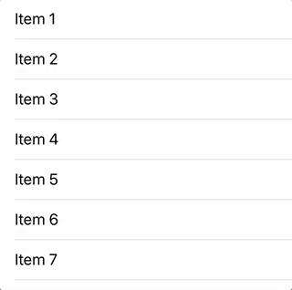

# SwiftReorder

SwiftReorder is a UITableView extension that lets you add long-press drag-and-drop reordering to any table view. It's robust, lightweight, and fully customizable.



## Features

- Smooth animations
- Automatic edge scrolling
- Works with multiple table sections
- Customizable shadow, scaling, and transparency effects

## Installation

### CocoaPods

To integrate SwiftReorder into your Xcode project using CocoaPods, specify it in your `Podfile`:

```ruby
pod 'SwiftReorder', '~> 6.0'
```

### Carthage

To integrate SwiftReorder into your Xcode project using Carthage, specify it in your `Cartfile`:

```
github "adamshin/SwiftReorder" ~> 6.0
```

Remember to [add SwiftReorder to your Carthage build phase](https://github.com/Carthage/Carthage#if-youre-building-for-ios-tvos-or-watchos):

```
$(SRCROOT)/Carthage/Build/iOS/SwiftReorder.framework
```

and

```
$(BUILT_PRODUCTS_DIR)/$(FRAMEWORKS_FOLDER_PATH)/SwiftReorder.framework
```

### Manually

You can integrate SwiftReorder into your project manually by copying the contents of the `Source` folder into your project.

## Usage

### Setup

* Add the following line to your table view setup.
```swift
override func viewDidLoad() {
    // ...
    tableView.reorder.delegate = self
}
```
* Add this code to the beginning of your `tableView(_:cellForRowAt:)`.
```swift
func tableView(_ tableView: UITableView, cellForRowAt indexPath: IndexPath) -> UITableViewCell {
    if let spacer = tableView.reorder.spacerCell(for: indexPath) {
        return spacer
    }
    // ...
}
```
* Implement the `tableView(_:reorderRowAt:to:)` delegate method, and others as necessary.
```swift
extension MyViewController: TableViewReorderDelegate {
    func tableView(_ tableView: UITableView, reorderRowAt sourceIndexPath: IndexPath, to destinationIndexPath: IndexPath) {
        // Update data model
    }
}
```
This method is analogous to the `UITableViewDataSource` method `tableView(_:moveRowAt:to:)`. However, it may be called multiple times in the course of one drag-and-drop action.

### Customization
SwiftReorder exposes several properties for adjusting the style of the reordering effect. For example, you can add a scaling effect to the selected cell:
```swift
tableView.reorder.cellScale = 1.05
```
Or adjust the shadow:
```swift
tableView.reorder.shadowOpacity = 0.5
tableView.reorder.shadowRadius = 20
```
